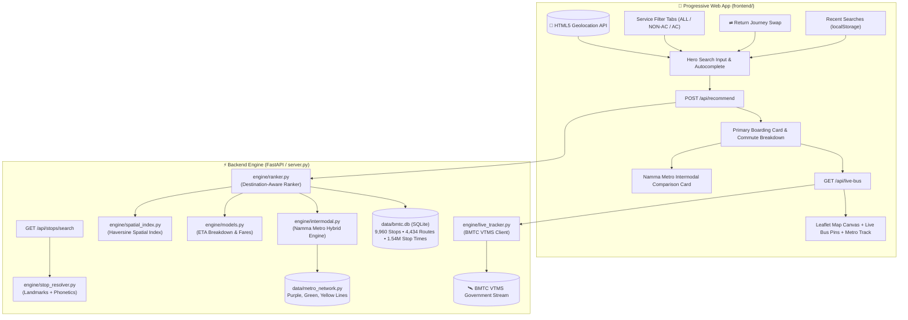

<div align="center">


<br/>

[](https://www.python.org/)
[](https://fastapi.tiangolo.com/)
[](https://sqlite.org/)
[](#-namma-metro-bmrcl-intermodal-routing)
[](#-real-time-bmtc-vtms-telemetry)
[](#-shakti-scheme--daily-pass-intelligence)
[-brightgreen.svg?style=for-the-badge)](#-pre-deployment-verification)
[](https://nammabmtc-navigator.onrender.com)
[](LICENSE)

<p align="center">
  <strong>Next-generation destination-aware transit boarding recommender, multi-transfer routing engine, Namma Metro intermodal planner, and real-time VTMS bus telemetry for Bengaluru Urban &amp; Rural.</strong>
</p>

<p align="center">
  <a href="https://nammabmtc-navigator.onrender.com" target="_blank">
    
  </a>
</p>

[Live Website](https://nammabmtc-navigator.onrender.com) • [Key Capabilities](#-key-capabilities) • [The Bengaluru Transit Problem](#-the-bengaluru-transit-problem) • [Architecture](#-architecture) • [API Reference](#-api-reference) • [Verification Suite](#-pre-deployment-verification)

</div>

---

## 🚦 The Bengaluru Transit Problem

Navigating public bus and metro transit in Bengaluru poses unique challenges that generic map engines frequently fail to resolve:

1. **Multi-Platform Highway Junctions**: Major hubs like *Central Silk Board*, *Hebbal*, *Tin Factory*, and *Majestic* host up to 10 distinct boarding platforms scattered across elevated flyovers, underpasses, and service roads. Traditional navigators recommend stops based on raw geometric distance, frequently stranding passengers on the wrong side of an uncrossable 12-lane highway.
2. **Directional Inversion**: Recommending a physically closer stop where buses are heading in the opposite direction wastes 45+ minutes in detours and turnarounds.
3. **Colloquial Naming vs. GTFS Transliterations**: Official GTFS databases store stops in Kannada phonetic transliterations (e.g. `Manyatha Tech Park` with `th`, `Malleshwara` with `sh`, `Kundalahalli Gate` for Brookefield, `Singaianapalya Phoenix` for Phoenix Marketcity). Generic keyword searches return zero results.
4. **Information Asymmetry**: Commuters lack visibility into **total door-to-door commute time**, **expected wait headways**, **en-route landmark waypoints**, **Shakti Scheme eligibility**, and **Namma Metro time-saving alternatives**.

**NammaBMTC Navigator** solves this from first principles using destination-aware candidate filtering, calibrated pedestrian topology, transliteration normalizers, BMRCL intermodal integration, and live BMTC satellite telemetry.

---

## ✨ Key Capabilities

### 🎯 1. Destination-Aware Platform Selection
Evaluates candidate stops within pedestrian proximity ($R \le 1200\text{m}$, expanding up to $2400\text{m}$ for peri-urban radials), strictly verifying trip sequence order ($seq_{\text{dest}} > seq_{\text{orig}}$) before scoring. Prevents recommending opposite-direction highway stops.

### 🔍 2. 100% Accurate Stop & Landmark Resolver
Built-in Bengaluru transit intelligence resolving colloquial tech parks, hospitals, colleges, malls, and suburban hubs:
- **Curated Bengaluru Landmark Dictionary**: 100+ points of interest mapped to exact GTFS stops (*Manyata Tech Park, Ecospace, RMZ Ecoworld, Brookefield, ITPL, Electronic City, Phoenix Marketcity, Mantri Square, Christ University, PES University, Jayadeva Hospital, NIMHANS*).
- **Kannada-English Phonetic Normalizer**: Handles colloquial vowel and consonant variations (`sh` $\leftrightarrow$ `s`, `th` $\leftrightarrow$ `t`, `w` $\leftrightarrow$ `v`, `-nagar` $\leftrightarrow$ `-nagara`, `-pur` $\leftrightarrow$ `-pura`, `-ur` $\leftrightarrow$ `-uru`).
- **GTFS Prefix Scrubbing**: Strips raw internal prefixes (`CS-`) so passengers see clean, readable stop names (*Kempegowda Bus Station* instead of *CS-Kempegowda Bus Station*).

### 🚇 3. Namma Metro (BMRCL) Intermodal Routing
Automatically computes parallel or hybrid metro transit options when faster than bus travel:
- **Comprehensive Line Coverage**: Purple Line (Challaghatta $\leftrightarrow$ Whitefield/Kadugodi), Green Line (Madavara/BIEC $\leftrightarrow$ Silk Institute), and Yellow Line (RV Road $\leftrightarrow$ Bommasandra).
- **Smart Time-Savings Highlights**: Prominently flags when Namma Metro saves significant commute time (e.g. `⚡ FASTEST: NAMMA METRO HYBRID • SAVES ~74 min`).
- **Interactive Polyline Map**: 1-tap Leaflet map overlay visualizing the exact metro track, boarding station, and alighting station.

### 🚌 4. Service Filtering & Official Staged Fares
3-way service category toggle allowing commuters to customize their transit mode:
- **Non-AC Ordinary**: Sarige, Suvarna, Pushpak, and City Feeder services (official BMTC stage fares: ₹5 to ₹30).
- **AC Vajra (Volvo)**: Air-conditioned city express services (official stage fares: ₹20 to ₹95).
- **Vayu Vajra Airport Express**: Dedicated airport shuttles (`KIA-` routes, fares: ₹150 to ₹280).

### 🌸 5. Shakti Scheme & Daily Pass Intelligence
- **Shakti Scheme Eligible**: Instantly flags routes where women domiciled in Karnataka travel free of cost on all non-AC ordinary services.
- **Pass Validity Indicators**: Clarifies acceptance of the **₹70 BMTC Ordinary Day Pass** vs. the **₹140 Vajra Gold Day Pass**.

### ⏱️ 6. Commute Duration Breakdown & Milestone Waypoints
- **Total Journey ETA**: Complete travel duration computed as:
  $$\text{Total Time} = \text{Walk Time} + \text{Wait Headway} + \text{Ride Time} + \text{Transfer Delay}$$
- **Dynamic Headway Estimation**: Automatically calculates average wait intervals from daily trip frequencies (e.g. `High Frequency • Bus every ~4–7 mins • 129 trips/day`).
- **En-Route Milestone Reassurance**: Extracts intermediate landmark waypoints along the route sequence (e.g. `🚏 Passes: Corporation ➔ Shanthinagar TTMC ➔ Dairy Circle ➔ St Johns Hospital`).

### 📡 7. Real-Time BMTC VTMS Satellite Telemetry
Direct connection to BMTC’s Vehicle Tracking and Monitoring System:
- Identifies approaching buses, vehicle license plates (`KA-01-...`), and dynamic ETAs.
- Renders live bus positions on the interactive Leaflet map canvas.

### ⇄ 8. Return Journey 1-Tap Commute Swap
Integrated swap button (`⇄ Return`) instantly reverses the commute origin and destination without retyping.

### 🎨 9. Windows XP Luna & Frutiger Aero Design System
Authentic retro-modern aesthetic featuring Luna Royal Blue headers, glossy acrylic buttons, 3D animated compass heading needle, and responsive PWA layout.

---

## 🏗️ Architecture



---

## 📊 Pre-Deployment Verification

All capabilities across all corridors, services, and edge situations are verified via [`scripts/verify_all_use_cases.py`](scripts/verify_all_use_cases.py).

```bash
python3 scripts/verify_all_use_cases.py
```

<details open>
<summary><strong>Test Suite Execution Report (54/54 Tests Passed - 100%)</strong></summary>

| Section | Test Category | Verification Scope | Status |
|:---|:---|:---|:---:|
| **1. Server Health** | Health Probes | `GET /health` & `GET /api/health` (9,960 stops indexed) | ✅ **PASS** |
| **2. Smart Stop Search** | Transit Hubs | `majestic`, `kbs`, `airport`, `silk board`, `itpl`, `ecity`, `whitefield`, `kr market` | ✅ **PASS** |
| | Colloquial Landmarks | `manyata` $\rightarrow$ Manyatha Tech Park, `malleswaram` $\rightarrow$ Malleshwara Circle | ✅ **PASS** |
| | IT Parks & Malls | `brookefield` $\rightarrow$ Kundalahalli, `ecospace` $\rightarrow$ Eco Space, `phoenix marketcity` $\rightarrow$ Singaianapalya Phoenix | ✅ **PASS** |
| | Hospitals & Colleges | `jayadeva` $\rightarrow$ East End Jayanagara, `christ university` $\rightarrow$ Dairy Circle | ✅ **PASS** |
| | GPS Proximity | Real-time distance badges relative to user coordinates | ✅ **PASS** |
| **3. Transit Corridors** | Central $\rightarrow$ IT Hub | Majestic to Electronic City (Direct: KBS-3E) | ✅ **PASS** |
| | Peri-Urban Arterial | BTL College to Anekal (Arterial via Hebbagodi) | ✅ **PASS** |
| | ORR Express Hub | Silk Board to Hebbal (Transfer: 500-D $\rightarrow$ 415-H) | ✅ **PASS** |
| | Airport Vayu Vajra | Majestic to KIA Airport (Direct: KIA-9) | ✅ **PASS** |
| | Tech Corridor | Whitefield / ITPL to Majestic (Direct: KBS-1I) | ✅ **PASS** |
| | South to North | Banashankari to Yelahanka (Transfer via Majestic) | ✅ **PASS** |
| | West to East | Kengeri to ITPL (Transfer via Banashankari) | ✅ **PASS** |
| | Rural Fringe | Hoskote to Majestic (Direct: 317-HS) | ✅ **PASS** |
| | Short City Hop | Indiranagar to MG Road (Direct: 314-P) | ✅ **PASS** |
| | Industrial Belt | Jigani to Electronic City (Transfer: 365-P $\rightarrow$ 378) | ✅ **PASS** |
| **4. VTMS Telemetry** | Single Route Tracking | Routes `500-D` (ORR), `365` (Bannerghatta Rd) | ✅ **PASS** |
| | Multi-Route Aggregation | Comma-separated query (`365, 365-P, 366`) | ✅ **PASS** |
| | Airport Telemetry | Route `KIA-9` (Airport Express) | ✅ **PASS** |
| **5. Static & PWA** | Web Integrity | `/`, `/index.html`, `/style.css`, `/app.js`, `/manifest.json`, `/robots.txt`, `/sitemap.xml`, logos | ✅ **PASS** |
| **6. Namma Metro** | Network API | `/api/metro/network` (Purple: 37, Green: 32, Yellow: 16 stations) | ✅ **PASS** |
| | Intermodal Routes | Purple Line (Majestic $\leftrightarrow$ ITPL saves ~74m, Kengeri $\leftrightarrow$ ITPL), Green Line, Yellow Line | ✅ **PASS** |
| **7. Service Filtering** | Non-AC Ordinary | Strict non-AC filtering, Shakti Scheme tag, ₹10–₹30 fare range | ✅ **PASS** |
| | AC Vajra Volvo | Strict AC Volvo filtering, ₹50–₹95 fare range | ✅ **PASS** |
| | Vayu Vajra Airport | Airport express filtering, ₹150–₹260 fare range | ✅ **PASS** |
| | Unfiltered Mixed | Mixed service tag with staged fare spreads | ✅ **PASS** |
| **8. Commute Breakdown** | Travel Time ETA | Total journey duration, walk time, ride time, wait headway | ✅ **PASS** |
| | Milestone Waypoints | Key en-route milestone stops extraction | ✅ **PASS** |
| | Scheme Eligibility | Shakti Scheme and BMTC pass eligibility validation | ✅ **PASS** |

</details>

---

## 🚀 Quick Start

### 1. Clone & Setup

```bash
git clone https://github.com/Shreyas0047/NammaBMTC-Navigator.git
cd NammaBMTC-Navigator
```

### 2. Install Dependencies

```bash
python3 -m venv .venv
source .venv/bin/activate
pip install -r requirements.txt
```

### 3. Run Development Server

```bash
python3 server.py
```
Open your browser at `http://localhost:8000`. The application is fully functional offline with zero external API keys required.

---

## 🌐 Live Production Deployment

The application is deployed 24/7 on Render:

<div align="center">

| Environment | Production URL | Status | Health Probe |
|:---|:---|:---:|:---|
| **Live PWA App** | [**nammabmtc-navigator.onrender.com**](https://nammabmtc-navigator.onrender.com) | -success?style=flat-square) | [`/health`](https://nammabmtc-navigator.onrender.com/health) |

<br/>

[](https://nammabmtc-navigator.onrender.com)

</div>

---

## 🔌 API Reference

### 1. Health Check
```http
GET /health
```
```json
{
  "status": "healthy",
  "service": "NammaBMTC Navigator",
  "version": "1.0.0",
  "stops_indexed": 9960
}
```

### 2. Smart Search with Landmarks & Phonetics
```http
GET /api/stops/search?q=manyata&user_lat=12.9716&user_lon=77.5946
```
```json
[
  {
    "stop_id": "10023",
    "stop_name": "Manyatha Tech Park",
    "raw_stop_name": "Manyatha Tech Park",
    "stop_desc": "Towards Hebbal / Nagawara",
    "lat": 13.0458,
    "lon": 77.6200,
    "dist_km": 8.6
  }
]
```

### 3. Generate Boarding Recommendation & Commute Breakdown
```http
POST /api/recommend
Content-Type: application/json

{
  "origin_lat": 12.9774,
  "origin_lon": 77.5708,
  "dest_lat": 12.9176,
  "dest_lon": 77.6238,
  "origin_name": "Majestic",
  "dest_name": "Silk Board",
  "service_filter": "ALL"
}
```
```json
{
  "status": "OK",
  "primary": {
    "stop_name": "Kempegowda Bus Station",
    "walk_distance_m": 120,
    "walk_duration_min": 2,
    "is_direct": true,
    "fare_range_str": "₹15 - ₹65",
    "service_tag": "Mixed (AC & Non-AC)",
    "pass_info": "₹70 BMTC Ordinary (Shakti Scheme) / ₹140 Vajra Pass Valid",
    "journey_breakdown": {
      "walk_time_min": 2,
      "ride_time_min": 42,
      "wait_headway_min": 4,
      "total_journey_min": 48,
      "headway_desc": "Every ~4–7 mins (High Frequency)",
      "shakti_scheme_eligible": true,
      "key_milestones": ["Subbaiah Circle", "Lakkasandra", "St Johns Hospital"]
    },
    "routes": [
      {
        "route": "KBS-3A",
        "towards": "Attibele Bus Stand",
        "trips_per_day": 129,
        "stops_away": 19,
        "estimated_fare": 25,
        "is_ac": false,
        "shakti_eligible": true,
        "enroute_milestones": ["Subbaiah Circle", "Lakkasandra", "St Johns Hospital"]
      }
    ]
  },
  "metro_option": null
}
```

### 4. Namma Metro Network Metadata
```http
GET /api/metro/network
```
Returns line station sequences, colors, and GeoJSON polylines for Purple, Green, and Yellow lines.

### 5. Real-Time VTMS GPS Telemetry
```http
GET /api/live-bus?route=500-D&orig_lat=12.9176&orig_lon=77.6238&dest_lat=13.0358&dest_lon=77.5970
```
```json
{
  "live": true,
  "route": "500-D",
  "approaching_count": 4,
  "nearest_bus": {
    "vehicle_no": "KA-01-F-8821",
    "distance_km": 0.4,
    "eta_mins": 1,
    "lat": 12.9192,
    "lon": 77.6225
  },
  "all_active_buses": [...]
}
```

---

## 📂 Repository Structure

```
├── data/
│   ├── bmtc.db                   # High-performance SQLite database (1.54M sequences, 9,960 stops, 4,434 routes)
│   └── metro_network.py          # Complete BMRCL Namma Metro line coordinates & station models
├── engine/
│   ├── db.py                     # SQLite connection manager & pragmas
│   ├── intermodal.py             # Namma Metro hybrid routing & time-savings calculator
│   ├── live_tracker.py           # Real-time BMTC VTMS GPS ingestion & multi-route aggregation
│   ├── models.py                 # Domain models (ViableRouteOption, CandidateBoardingPoint, JourneyBreakdown)
│   ├── ranker.py                 # Destination-aware ranking, multi-leg transfer graph, & milestone extractor
│   ├── spatial_index.py          # Haversine spatial index & calibrated pedestrian routing
│   └── stop_resolver.py          # 100+ landmark aliases & bilingual Kannada-English phonetic engine
├── frontend/
│   ├── assets/                   # SVG banners, logos, and PWA icons
│   ├── app.js                    # Windows XP Luna UI controller, Leaflet maps, compass, telemetry
│   ├── index.html                # Responsive web app markup & stepper components
│   ├── manifest.json             # Progressive Web App manifest
│   └── style.css                 # Windows XP Luna / Frutiger Aero theme stylesheet
├── scripts/
│   ├── run_benchmarks.py         # 10-junction directional verification benchmarks
│   └── verify_all_use_cases.py   # Full 54-test automated pre-deployment verification suite
├── Procfile                      # Web process definition for cloud platforms
├── render.yaml                   # Zero-cost Render deployment blueprint
├── requirements.txt              # Minimal production dependencies (fastapi, uvicorn)
└── server.py                     # FastAPI backend application & static asset server
```

---

## 📜 License

Distributed under the [MIT License](LICENSE). Built with ❤️ for Bengaluru bus and metro commuters.
