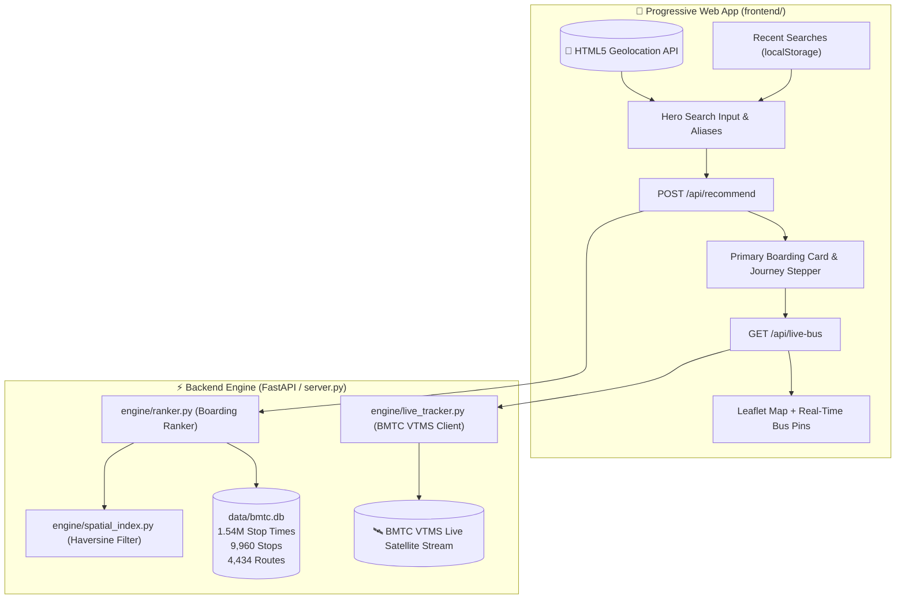

<div align="center">


<br/>

[](https://www.python.org/)
[](https://fastapi.tiangolo.com/)
[](https://sqlite.org/)
[](#-real-time-bmtc-vtms-telemetry)
[-brightgreen.svg?style=for-the-badge)](#-pre-deployment-verification)
[](#-zero-cost-deployment-render-free-tier)
[](LICENSE)

<p align="center">
  <strong>Next-generation destination-aware transit boarding recommender, multi-transfer routing engine, and real-time VTMS bus telemetry for Bengaluru Urban &amp; Rural.</strong>
</p>

[Key Capabilities](#-key-capabilities) • [The Bengaluru Transit Problem](#-the-bengaluru-transit-problem) • [Architecture](#-architecture) • [Live Demo Preview](#-live-journey-stepper-preview) • [API Reference](#-api-reference) • [Free Deployment](#-zero-cost-deployment-render-free-tier)

</div>

---

## 🚦 The Bengaluru Transit Problem

Navigating public transit in Bengaluru poses unique challenges that generic map engines frequently fail to resolve:

1. **Multi-Platform Highway Junctions**: Major hubs like *Central Silk Board*, *Hebbal*, *Tin Factory*, and *Majestic* host up to 10 distinct boarding platforms scattered across elevated flyovers, underpasses, and service roads. Traditional navigators recommend stops based on raw geometric distance, frequently stranding passengers on the wrong side of an uncrossable 12-lane highway.
2. **Directional Inversion**: Recommending a physically closer stop where buses are heading in the opposite direction wastes 45+ minutes in detours and turnarounds.
3. **Ghost Schedules vs. Live Fleet**: Static timetables in Bengaluru do not account for traffic bottlenecks on Outer Ring Road, Hosur Road, or Bellary Road.

**NammaBMTC Navigator** solves this from first principles using destination-aware candidate filtering, empirical walking constraints, and real-time BMTC satellite telemetry.

---

## ✨ Key Capabilities

* **🎯 Destination-Aware Platform Selection**: Evaluates all candidate stops within walking proximity ($R \le 1200\text{m}$, expanding up to $2400\text{m}$ for peri-urban radials), strictly verifying trip sequence order ($seq_{\text{dest}} > seq_{\text{origin}}$) before scoring.
* **🚶 Calibrated Pedestrian Router**: Uses an empirical ground-walk factor ($1.35\times$ Haversine) tuned to Bengaluru's pedestrian topology, penalizing road crossings and avoiding dangerous detours.
* **📡 Real-Time BMTC VTMS Satellite Telemetry**: Direct ingestion from BMTC’s Vehicle Tracking and Monitoring System. Locates approaching vehicles, computes heading bearings, and provides real-time ETAs.
* **🔄 Smart Multi-Transfer & Peri-Urban Corridors**: Automatically resolves 1-transfer and 2-transfer itineraries for peri-urban belts (e.g., *Anekal*, *Hoskote*, *Jigani*, *Nelamangala*, *Doddaballapura*).
* **⚡ Sub-35ms Query Performance**: Zero heavy external graph dependencies; leverages an optimized, indexed SQLite transit engine indexing **9,960 stops**, **4,434 routes**, and **1.54M stop sequences**.
* **📱 Mobile-First PWA Interface**: Ultra-clean, outdoor-readable light interface with instant GPS geocoding, smart search aliases, persistent recent searches, and 1-tap Google Maps turn-by-turn walking deep links.

---

## 🖥️ Live Journey Stepper Preview

<div align="center">
  
</div>

---

## 🏗️ Architecture



---

## 📊 Pre-Deployment Verification

All components and corridor use cases are continuously tested via [`scripts/verify_all_use_cases.py`](scripts/verify_all_use_cases.py).

```bash
python3 scripts/verify_all_use_cases.py
```

<details open>
<summary><strong>Test Suite Execution Report (35/35 Tests Passed - 100%)</strong></summary>

| Category | Corridor / Component | Verification Criteria | Status |
|---|---|---|:---:|
| **Health Checks** | `GET /health` & `/api/health` | HTTP 200, 9,960 stops indexed | ✅ **PASS** |
| **Smart Aliases** | `majestic`, `kbs` | Resolves to Kempegowda Bus Station | ✅ **PASS** |
| | `airport`, `kia` | Resolves to Kempegowda Intl Airport | ✅ **PASS** |
| | `silk board` | Resolves to Central Silk Board | ✅ **PASS** |
| | `itpl`, `whitefield` | Resolves to ITPL & Whitefield | ✅ **PASS** |
| | `ecity`, `kr market` | Resolves to Electronic City & KR Market | ✅ **PASS** |
| | GPS Distance Badges | Real-time km calculation relative to user coordinates | ✅ **PASS** |
| **Urban Corridors** | Central $\rightarrow$ IT Hub | Majestic to Electronic City (Direct: KBS-3E) | ✅ **PASS** |
| | Peri-Urban Arterial | BTL College to Anekal (Arterial via Hebbagodi) | ✅ **PASS** |
| | ORR Express Hub | Silk Board to Hebbal (Transfer: 500-D $\rightarrow$ 415-H) | ✅ **PASS** |
| | Airport Vayu Vajra | Majestic to KIA Airport (Direct: KIA-9) | ✅ **PASS** |
| | Tech Corridor | Whitefield / ITPL to Majestic (Direct: KBS-1I) | ✅ **PASS** |
| | South to North | Banashankari to Yelahanka (Transfer via Majestic) | ✅ **PASS** |
| | West to East | Kengeri to ITPL (Transfer via Banashankari) | ✅ **PASS** |
| | Rural Fringe NE | Hoskote to Majestic (Direct: 317-HS) | ✅ **PASS** |
| | Short City Hop | Indiranagar to MG Road (Direct: 314-P) | ✅ **PASS** |
| | Industrial Belt | Jigani to Electronic City (Transfer: 365-P $\rightarrow$ 378) | ✅ **PASS** |
| **VTMS Telemetry** | Route 500-D (ORR) | 30+ active buses located with live ETAs | ✅ **PASS** |
| | Route 365 | Active GPS tracking on Bannerghatta Rd | ✅ **PASS** |
| | Multi-Route Comma Query | Aggregate tracking (`365, 365-P, 366`) | ✅ **PASS** |
| **Static & PWA Assets** | HTML, CSS, JS, Manifest | All 200 OK, zero deprecated DOM elements | ✅ **PASS** |

</details>

---

## 🚀 Quick Start

### 1. Clone & Setup

```bash
git clone https://github.com/your-username/bmtc-recommender.git
cd bmtc-recommender
```

### 2. Install Dependencies

```bash
python3 -m venv .venv
source .venv/bin/activate
pip install -r requirements.txt
```

### 3. Run Development Server

```bash
python3 server.py
```
Open your browser at `http://localhost:8000`. The application is immediately functional.

---

## 🌐 Zero-Cost Deployment (Render Free Tier)

Deploying to production requires **$0/month** and takes under 2 minutes:

1. Push your code to a GitHub repository:
   ```bash
   git add .
   git commit -m "feat: production release"
   git push origin master
   ```
2. Open [Render.com](https://render.com) and click **New +** $\rightarrow$ **Blueprint**.
3. Select this repository. Render will automatically detect [`render.yaml`](render.yaml):
   * **Plan**: Free ($0/month)
   * **Region**: Singapore (lowest latency to India)
   * **Health Check**: `/health`
4. Click **Apply**. Your app will be live with free SSL at `https://your-app.onrender.com`.

> [!TIP]
> To prevent the free instance from sleeping after 15 minutes of inactivity, set up a free monitor on [UptimeRobot](https://uptimerobot.com) pinging `https://<your-app>.onrender.com/health` every 10 minutes.

---

## 🔌 API Reference

### 1. Health Check
```http
GET /health
```
```json
{
  "status": "healthy",
  "service": "NammaBMTC Navigator",
  "version": "1.0.0",
  "stops_indexed": 9960
}
```

### 2. Search Stops with Proximity
```http
GET /api/stops/search?q=silk+board&user_lat=12.9176&user_lon=77.6238
```
```json
[
  {
    "stop_id": "20707",
    "stop_name": "Central Silk Board",
    "stop_desc": "Towards Marathahalli / BTM",
    "lat": 12.9176,
    "lon": 77.6238,
    "dist_km": 0.05
  }
]
```

### 3. Generate Boarding Recommendation
```http
POST /api/recommend
Content-Type: application/json

{
  "origin_lat": 12.9774,
  "origin_lon": 77.5708,
  "dest_lat": 12.8452,
  "dest_lon": 77.6602,
  "origin_name": "Kempegowda Bus Station",
  "dest_name": "Electronic City"
}
```

### 4. Real-Time VTMS GPS Telemetry
```http
GET /api/live-bus?route=500-D&orig_lat=12.9176&orig_lon=77.6238&dest_lat=13.0358&dest_lon=77.5970
```
```json
{
  "live": true,
  "route": "500-D",
  "approaching_count": 4,
  "nearest_bus": {
    "vehicle_no": "KA-01-F-8821",
    "distance_km": 0.4,
    "eta_mins": 1,
    "lat": 12.9192,
    "lon": 77.6225
  }
}
```

---

## 📂 Repository Structure

```
├── data/
│   └── bmtc.db                   # Compiled SQLite database (Stops, Routes, Sequences)
├── engine/
│   ├── db.py                     # Database connection & query helper
│   ├── live_tracker.py           # Real-time BMTC VTMS GPS ingestion & bearing engine
│   ├── models.py                 # Core domain models (Stop, Route, Candidate)
│   ├── ranker.py                 # Destination-aware ranking & transfer algorithm
│   └── spatial_index.py          # Haversine proximity & radius search
├── frontend/
│   ├── assets/
│   │   ├── app-icon.jpg          # PWA touch icon
│   │   ├── banner.svg            # Animated vector banner
│   │   ├── logo.svg              # Brand vector logo
│   │   └── terminal-demo.svg     # Animated UI demo card
│   ├── app.js                    # Mobile-first frontend controller
│   ├── index.html                # Responsive web interface
│   ├── manifest.json             # Progressive Web App manifest
│   └── style.css                 # Clean, high-contrast design system
├── scripts/
│   ├── run_benchmarks.py         # 10-junction directional verification suite
│   └── verify_all_use_cases.py   # Comprehensive pre-deployment test suite
├── Procfile                      # Process configuration for cloud hosts
├── render.yaml                   # 1-Click zero-cost Render deployment blueprint
├── requirements.txt              # Minimal production dependencies
└── server.py                     # FastAPI web server & API endpoints
```

---

## 📜 License

Distributed under the [MIT License](LICENSE). Built with ❤️ for Bengaluru bus commuters.
