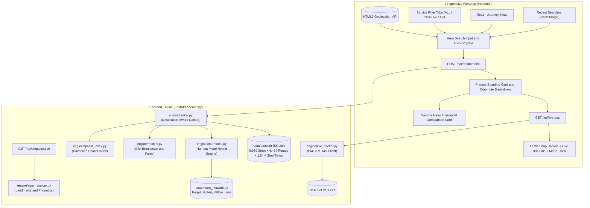

<div align="center">



<br/>

[](https://www.python.org/)
[](https://fastapi.tiangolo.com/)
[](https://sqlite.org/)
[](#namma-metro-bmrcl-intermodal-routing)
[](#real-time-bmtc-vtms-telemetry)
[](#shakti-scheme-and-daily-pass-intelligence)
[](https://nammabmtc-navigator.onrender.com)
[](LICENSE)

<p align="center">
  <strong>Next-generation destination-aware transit boarding recommender, multi-transfer routing engine, Namma Metro intermodal planner, and real-time VTMS bus telemetry for Bengaluru Urban and Rural.</strong>
</p>

<p align="center">
  <a href="https://nammabmtc-navigator.onrender.com" target="_blank">
    
  </a>
</p>

[Live Website](https://nammabmtc-navigator.onrender.com) • [Key Capabilities](#key-capabilities) • [The Bengaluru Transit Problem](#the-bengaluru-transit-problem) • [Architecture](#architecture) • [Quick Start](#quick-start) • [API Reference](#api-reference)

</div>

---

## The Bengaluru Transit Problem

Navigating public bus and metro transit in Bengaluru poses unique challenges that generic map engines frequently fail to resolve:

1. **Multi-Platform Highway Junctions**: Major transit hubs such as *Central Silk Board*, *Hebbal*, *Tin Factory*, and *Majestic* host up to 10 distinct boarding platforms scattered across elevated flyovers, underpasses, and service roads. Traditional navigators recommend stops based purely on raw geometric distance, frequently directing passengers to the wrong side of an uncrossable multi-lane highway.
2. **Directional Inversion**: Recommending a physically closer stop where buses operate in the opposite direction wastes 45+ minutes in detours and turnarounds.
3. **Colloquial Naming vs. GTFS Transliterations**: Official GTFS databases store stops in Kannada phonetic transliterations (e.g., `Manyatha Tech Park` with `th`, `Malleshwara` with `sh`, `Kundalahalli Gate` for Brookefield, `Singaianapalya Phoenix` for Phoenix Marketcity). Standard keyword queries often fail to return matching records.
4. **Information Asymmetry**: Commuters lack visibility into **total door-to-door commute duration**, **expected wait intervals**, **en-route landmark waypoints**, **Shakti Scheme eligibility**, and **Namma Metro time-saving alternatives**.

**NammaBMTC Navigator** addresses these challenges from first principles using destination-aware candidate filtering, calibrated pedestrian topology, transliteration normalizers, BMRCL intermodal integration, and live BMTC satellite telemetry.

---

## Key Capabilities

### 1. Destination-Aware Platform Selection
Evaluates candidate stops within pedestrian proximity ($R \le 1200\text{m}$, expanding up to $2400\text{m}$ for peri-urban radials), strictly verifying trip sequence order ($seq_{\text{dest}} > seq_{\text{orig}}$) prior to scoring. Eliminates opposite-direction platform suggestions.

### 2. Accurate Stop and Landmark Resolver
Built-in Bengaluru transit intelligence resolving colloquial tech parks, hospitals, educational institutions, commercial centers, and suburban hubs:
- **Curated Bengaluru Landmark Index**: 100+ points of interest mapped to exact GTFS stops (*Manyata Tech Park, Ecospace, RMZ Ecoworld, Brookefield, ITPL, Electronic City, Phoenix Marketcity, Mantri Square, Christ University, PES University, Jayadeva Hospital, NIMHANS*).
- **Kannada-English Phonetic Normalizer**: Handles colloquial vowel and consonant variations (`sh` $\leftrightarrow$ `s`, `th` $\leftrightarrow$ `t`, `w` $\leftrightarrow$ `v`, `-nagar` $\leftrightarrow$ `-nagara`, `-pur` $\leftrightarrow$ `-pura`, `-ur` $\leftrightarrow$ `-uru`).
- **GTFS Prefix Sanitization**: Strips raw internal database codes (`CS-`) so passengers see clean, readable stop names (*Kempegowda Bus Station* instead of *CS-Kempegowda Bus Station*).

### 3. Namma Metro (BMRCL) Intermodal Routing
Automatically computes parallel or hybrid metro transit options when faster than bus transit:
- **Comprehensive Line Coverage**: Purple Line (Challaghatta $\leftrightarrow$ Whitefield/Kadugodi), Green Line (Madavara/BIEC $\leftrightarrow$ Silk Institute), and Yellow Line (RV Road $\leftrightarrow$ Bommasandra).
- **Time-Savings Calculations**: Highlights when Namma Metro provides substantial travel time savings (e.g., `FASTEST: NAMMA METRO HYBRID - SAVES ~74 min`).
- **Interactive Polyline Map**: One-tap Leaflet map overlay displaying the exact metro alignment, boarding station, and alighting station.

### 4. Service Filtering and Official Staged Fares
Three-way service category filtering allowing commuters to customize their transit preferences:
- **Non-AC Ordinary**: Sarige, Suvarna, Pushpak, and City Feeder services (official BMTC stage fares: ₹5 to ₹30).
- **AC Vajra (Volvo)**: Air-conditioned city express services (official stage fares: ₹20 to ₹95).
- **Vayu Vajra Airport Express**: Dedicated airport shuttles (`KIA-` routes, fares: ₹150 to ₹280).

### 5. Shakti Scheme and Daily Pass Intelligence
- **Shakti Scheme Eligibility**: Identifies routes where women domiciled in Karnataka travel free of cost on non-AC ordinary services.
- **Pass Acceptance Indicators**: Clarifies validity for the **₹70 BMTC Ordinary Day Pass** and the **₹140 Vajra Gold Day Pass**.

### 6. Commute Duration Breakdown and Milestone Waypoints
- **Total Journey ETA**: Complete travel duration computed as:
  $$\text{Total Time} = \text{Walk Time} + \text{Wait Headway} + \text{Ride Time} + \text{Transfer Delay}$$
- **Dynamic Headway Estimation**: Automatically calculates average wait intervals from daily trip frequencies (e.g., `High Frequency - Bus every ~4–7 mins - 129 trips/day`).
- **En-Route Milestone Verification**: Extracts intermediate landmark waypoints along the route sequence (e.g., `Passes: Corporation -> Shanthinagar TTMC -> Dairy Circle -> St Johns Hospital`).

### 7. Real-Time BMTC VTMS Satellite Telemetry
Direct connection to BMTC's Vehicle Tracking and Monitoring System:
- Identifies approaching buses, vehicle registration numbers (`KA-01-...`), and dynamic ETAs.
- Renders live bus positions directly on the interactive Leaflet map canvas.

### 8. Return Journey One-Tap Commute Swap
Integrated swap control (`Return`) instantly reverses origin and destination without re-entering search parameters.

### 9. Windows XP Luna and Frutiger Aero Design System
Retro-modern interface featuring Luna Royal Blue titlebars, tactile buttons, 3D animated compass heading needle, and responsive PWA architecture.

---

## Architecture



---

## Quick Start

### 1. Clone Repository

```bash
git clone https://github.com/Shreyas0047/NammaBMTC-Navigator.git
cd NammaBMTC-Navigator
```

### 2. Install Dependencies

```bash
python3 -m venv .venv
source .venv/bin/activate
pip install -r requirements.txt
```

### 3. Run Development Server

```bash
python3 server.py
```
Access the application at `http://localhost:8000`. The service is self-contained and operates without third-party external API keys.

---

## Production Deployment

The application is deployed continuously on Render:

<div align="center">

| Environment | Production URL | Status | Health Probe |
|:---|:---|:---:|:---|
| **Live PWA App** | [**nammabmtc-navigator.onrender.com**](https://nammabmtc-navigator.onrender.com) | -success?style=flat-square) | [`/health`](https://nammabmtc-navigator.onrender.com/health) |

<br/>

[](https://nammabmtc-navigator.onrender.com)

</div>

---

## API Reference

### 1. Health Check
```http
GET /health
```
```json
{
  "status": "healthy",
  "service": "NammaBMTC Navigator",
  "version": "1.0.0",
  "stops_indexed": 9960
}
```

### 2. Smart Search with Landmarks and Phonetics
```http
GET /api/stops/search?q=manyata&user_lat=12.9716&user_lon=77.5946
```
```json
[
  {
    "stop_id": "10023",
    "stop_name": "Manyatha Tech Park",
    "raw_stop_name": "Manyatha Tech Park",
    "stop_desc": "Towards Hebbal / Nagawara",
    "lat": 13.0458,
    "lon": 77.6200,
    "dist_km": 8.6
  }
]
```

### 3. Boarding Recommendation and Commute Breakdown
```http
POST /api/recommend
Content-Type: application/json

{
  "origin_lat": 12.9774,
  "origin_lon": 77.5708,
  "dest_lat": 12.9176,
  "dest_lon": 77.6238,
  "origin_name": "Majestic",
  "dest_name": "Silk Board",
  "service_filter": "ALL"
}
```
```json
{
  "status": "OK",
  "primary": {
    "stop_name": "Kempegowda Bus Station",
    "walk_distance_m": 120,
    "walk_duration_min": 2,
    "is_direct": true,
    "fare_range_str": "₹15 - ₹65",
    "service_tag": "Mixed (AC & Non-AC)",
    "pass_info": "₹70 BMTC Ordinary (Shakti Scheme) / ₹140 Vajra Pass Valid",
    "journey_breakdown": {
      "walk_time_min": 2,
      "ride_time_min": 42,
      "wait_headway_min": 4,
      "total_journey_min": 48,
      "headway_desc": "Every ~4–7 mins (High Frequency)",
      "shakti_scheme_eligible": true,
      "key_milestones": ["Subbaiah Circle", "Lakkasandra", "St Johns Hospital"]
    },
    "routes": [
      {
        "route": "KBS-3A",
        "towards": "Attibele Bus Stand",
        "trips_per_day": 129,
        "stops_away": 19,
        "estimated_fare": 25,
        "is_ac": false,
        "shakti_eligible": true,
        "enroute_milestones": ["Subbaiah Circle", "Lakkasandra", "St Johns Hospital"]
      }
    ]
  },
  "metro_option": null
}
```

### 4. Namma Metro Network Metadata
```http
GET /api/metro/network
```
Returns line station sequences, line colors, and GeoJSON polylines for Purple, Green, and Yellow lines.

### 5. Real-Time VTMS GPS Telemetry
```http
GET /api/live-bus?route=500-D&orig_lat=12.9176&orig_lon=77.6238&dest_lat=13.0358&dest_lon=77.5970
```
```json
{
  "live": true,
  "route": "500-D",
  "approaching_count": 4,
  "nearest_bus": {
    "vehicle_no": "KA-01-F-8821",
    "distance_km": 0.4,
    "eta_mins": 1,
    "lat": 12.9192,
    "lon": 77.6225
  },
  "all_active_buses": [...]
}
```

---

## Repository Structure

```
├── data/
│   ├── bmtc.db                   # SQLite database (1.54M sequences, 9,960 stops, 4,434 routes)
│   └── metro_network.py          # BMRCL Namma Metro station models and coordinates
├── engine/
│   ├── db.py                     # SQLite connection manager and pragmas
│   ├── intermodal.py             # Namma Metro hybrid routing and time-savings calculator
│   ├── live_tracker.py           # Real-time BMTC VTMS GPS ingestion and multi-route aggregation
│   ├── models.py                 # Domain models (ViableRouteOption, CandidateBoardingPoint, JourneyBreakdown)
│   ├── ranker.py                 # Destination-aware ranking, multi-leg transfer graph, and milestone extractor
│   ├── spatial_index.py          # Haversine spatial index and pedestrian routing
│   └── stop_resolver.py          # Landmark aliases and bilingual Kannada-English phonetic engine
├── frontend/
│   ├── assets/                   # SVG banners, logos, and PWA icons
│   ├── app.js                    # UI controller, Leaflet maps, compass, telemetry
│   ├── index.html                # Web app markup and journey stepper components
│   ├── manifest.json             # Progressive Web App manifest
│   └── style.css                 # Theme stylesheet
├── scripts/
│   ├── run_benchmarks.py         # Directional verification benchmarks
│   └── verify_all_use_cases.py   # Automated end-to-end verification suite
├── Procfile                      # Web process definition for cloud platforms
├── render.yaml                   # Render deployment configuration
├── requirements.txt              # Production dependencies (fastapi, uvicorn)
└── server.py                     # FastAPI backend application and static asset server
```

---

## License

Distributed under the [MIT License](LICENSE). Built for Bengaluru bus and metro commuters.
